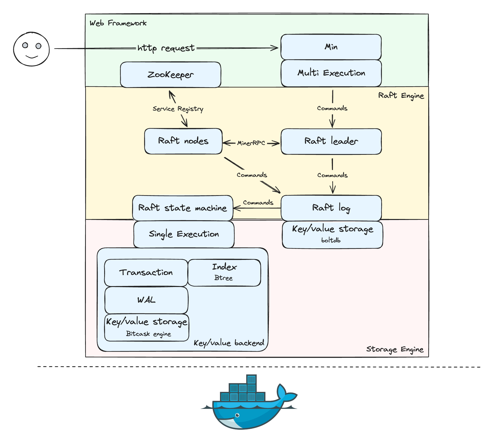
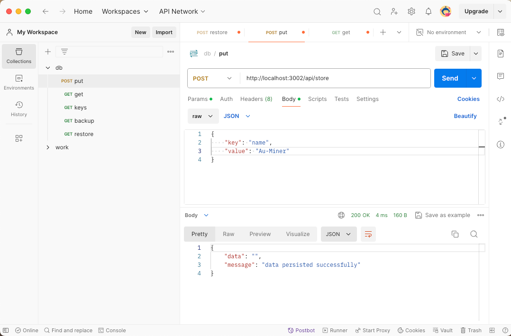
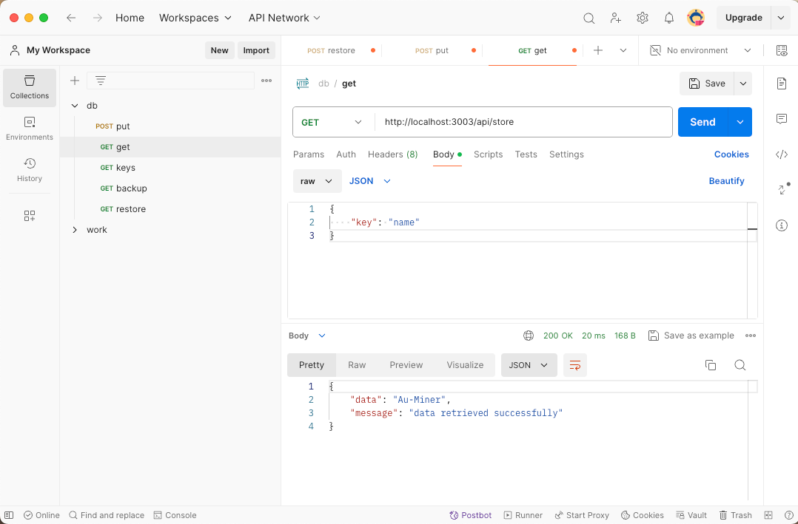

# MinerDB

中文版见 [README_CHI](static/README_CHI.md)

## What is MinerDB
MinerDB is a lightweight, simple, and reliable distributed key-value storage engine based on the Raft consensus algorithm. It supports distributed transactions, containerized deployment, service registry, disk storage, etc.

## Status
Currently, MinerDB is recommended for learning and personal projects only and is not recommended for production environments.

## Design Overview


## Main Modules
MinerDB currently consists of the following main modules: MinerRPC, Min, Raft, and MinerDB.

### MinerRPC
MinerRPC is a pure GO language RPC framework based on Socket+Zookeeper.
MinerRPC supports dynamic proxy, network transmission, serialization, service registration, service discovery, and service invocation.

MinerDB uses MinerRPC as the internal communication framework for the cluster, Zookeeper as the service registry, and supports dynamic vertical scaling of containers.

For more information, see [minerrpc](https://github.com/Au-Miner/minerrpc)

### Min
Min is a lightweight, simplified version of the Gin framework. Min focuses on performance and simplicity, implementing most of Gin's basic features including routing, middleware, request/response handling, error handling, and route grouping for quickly building HTTP services.

MinerDB uses Min to provide HTTP services externally.

For more information, see [min](https://github.com/Au-Miner/min)

### Raft
MinerDB uses the Raft consensus algorithm for data replication and consistency guarantees. Write requests support linearizability, and read requests support sequential consistency.
1. Read requests: Can be sent to any node in the cluster and executed.
2. Write requests: Sent to the Leader node, which broadcasts the write request to other nodes in the cluster. Once the majority of nodes have successfully written the data, the Leader node commits the write request.

### MinerDB
MinerDB is divided into the Execution layer and the Storage layer.
1. The Execution layer provides interfaces for upper-level operators and the local storage engine.
2. The Storage layer implements persistent data storage based on WAL (Write-Ahead Logging) and Bitcask, and indexing based on BTree. It supports read-write lock management, ACID transactions, repeatable read isolation level, and high write operation efficiency.
    1. WAL: Stores log information in WAL during transaction execution and updates to in-memory Bitcask during the commit phase.
    2. Atomicity: Uses strict two-phase locking protocol, only supports data updates during the commit phase.
    3. Isolation: Implemented with read-write locks.
    4. Durability: Achieved by setting the interval for writing Bitcask data from memory to disk.
    5. Repeatable Read: Write operations of a transaction are only updated to in-memory Bitcask during the commit phase, and no other read operations are affected by write operations.
    6. GC: Periodically merges disk files and writes index information to Hintfile.

## Future Plan
- [ ] Deadlock detection
- [ ] Improve Raft stability
- [ ] Implement more index structures
- [ ] Support more transaction isolation levels
- [ ] Support SQL, implement database frontend (Parser, Planner, Optimizer)
- [ ] Support more operators
- [ ] Support forward and backward iterators

## Getting Started
Supports containerized deployment with docker-compose
```sh
docker-compose up --build -d
```
This will create 1 ZooKeeper container and 5 MinerDB containers, 
each providing services on ports 3001 to 3005

It can be accessed through any `port` that provides services` http://localhost:<port>/app/store ` Execute a Post request to store data, with the request body in JSON format
```
{
   "Key": "key_example",
   "Value": "value example"
}
```
It can also be accessed through any `port` that provides services` http://localhost:<port>/app/store ` Send a Get request to retrieve data, with the request body in JSON format
```
{
   "Key": "key_example"
}
```
**Image example:**

Put data:



Get data:



## Thanks
MinerDB is inspired by etcd, oceanbase, nubedb, rosedb, and waterdb. Many thanks 🙏
